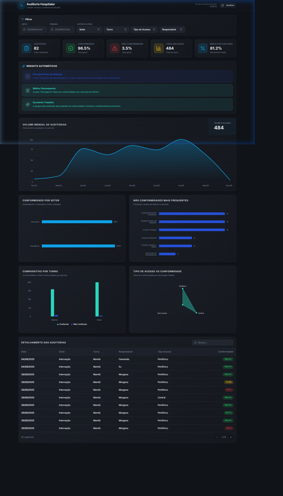

# Audit Insights Hub - Portal de Auditoria Hospitalar

O **Audit Insights Hub** é uma plataforma analítica de alta fidelidade voltada para a gestão de conformidade em protocolos de **Cateter Venoso e Sistemas de Infusão**. Desenvolvido com um design focado em usabilidade clínica, o sistema transforma dados brutos de auditoria em visualizações estratégicas que auxiliam na tomada de decisão e na melhoria contínua dos processos assistenciais.

## 📋 Sobre o Projeto

Este dashboard foi projetado para fornecer uma visão 360° da qualidade dos cuidados hospitalares. Ele consolida informações vindas de auditorias de campo, permitindo monitorar indicadores críticos como integridade de curativos, validade de equipamentos e conformidade técnica por setor e turno.

## ✨ Funcionalidades Principais

- **Visualização Temporal (Área)**: Acompanhamento dinâmico do volume mensal de auditorias para monitorar a produtividade da equipe.
- **Insights Automáticos**: Algoritmo inteligente que identifica automaticamente o melhor desempenho, o principal ponto de atenção e tendências de mercado sem necessidade de análise manual.
- **Gráficos Multidimensionais**:
  - **Gráfico de Radar**: Análise comparativa de conformidade por tipo de acesso (Central, Periférico, etc).
  - **Ranking de Não Conformidades**: Identificação visual rápida das causas mais frequentes de falhas.
- **Sincronização em Tempo Real**: Conexão nativa com base de dados via planilha, com feedback visual de carregamento e selo de "Última Sincronização".
- **Filtros Avançados**: Refinamento granular por Setor, Turno, Responsável e Período, com persistência de estado e reset inteligente.
- **Tabela de Detalhamento**: Visualização íntegra de cada registro de auditoria com status de conformidade codificado por cores.

## 🎨 Design System: "Clinical Curator"

O projeto utiliza um design system customizado que prioriza o bem-estar visual no ambiente hospitalar:
- **Teal Clínico (`#2bd4bd`)**: Representa conformidade e sucesso assistencial.
- **Indigo Profissional**: Utilizado para diferenciação de dados e pontos de atenção, evitando o uso de cores de "perigo" que geram estresse desnecessário.
- **Interface Glassmorphism**: Cards com efeito translúcido e bordas suaves, otimizados para o modo escuro, garantindo conforto visual durante longas jornadas de trabalho.

## 🛠️ Tecnologias Utilizadas

- **Frontend**: React.js / Vite
- **Estilização**: Tailwind CSS / Shadcn/ui
- **Visualização de Dados**: Recharts
- **Gerenciamento de Estado**: TanStack Query (React Query)
- **Ícones**: Lucide React
- **Base de Dados**: Google Sheets Integration via PapaParse

---
*Este projeto foi desenvolvido como uma solução moderna de Business Intelligence para gestão de qualidade hospitalar.*
